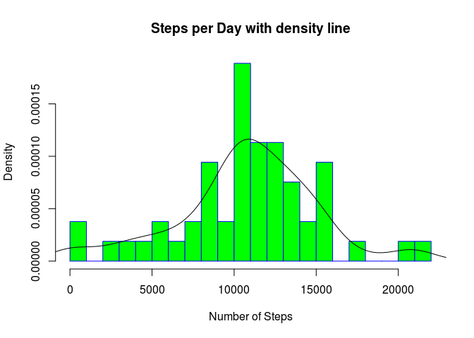
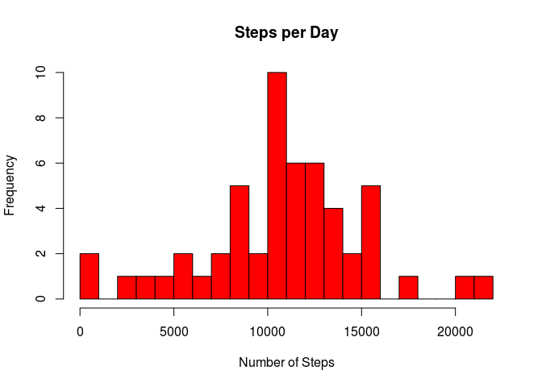
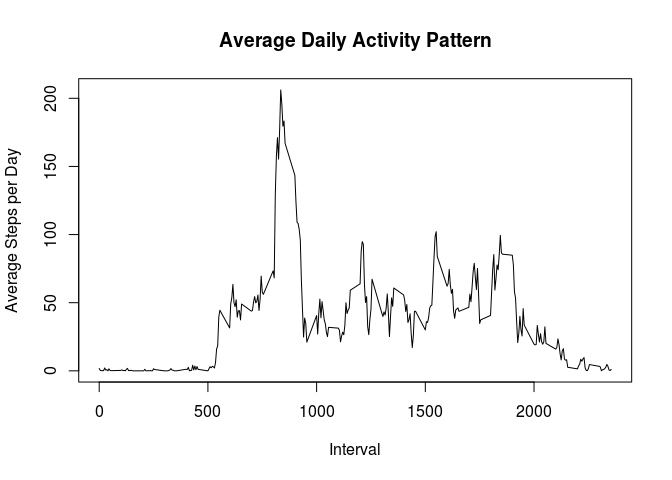
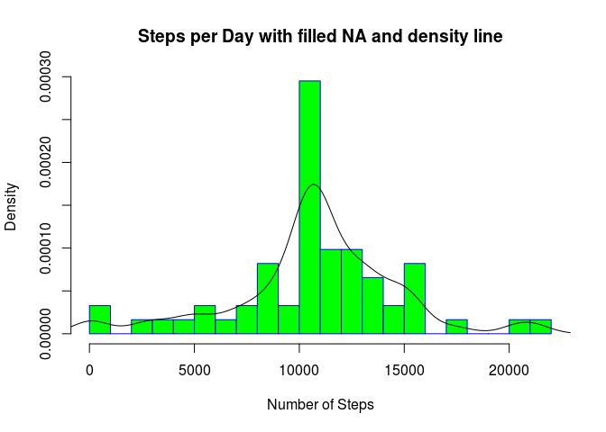
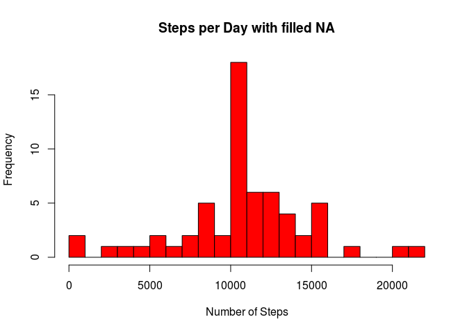
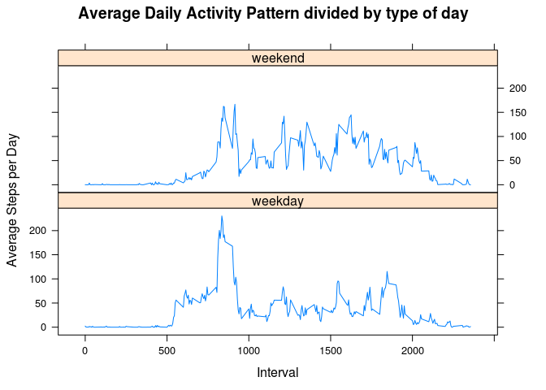

# PA1_template
Silvio Gabban  
03 aprile 2016  
<h1>Reproducible Research Assignment: Course Project 1<h1>
<h6 style="color:red">Introduction</h6>
<h6 style="color:red">It is now possible to collect a large amount of data about personal movement using activity monitoring devices such as a Fitbit, Nike Fuelband, or Jawbone Up. These type of devices are part of the “quantified self” movement – a group of enthusiasts who take measurements about themselves regularly to improve their health, to find patterns in their behavior, or because they are tech geeks. But these data remain under-utilized both because the raw data are hard to obtain and there is a lack of statistical methods and software for processing and interpreting the data.</h6>
<h6 style="color:red">This assignment makes use of data from a personal activity monitoring device. This device collects data at 5 minute intervals through out the day. The data consists of two months of data from an anonymous individual collected during the months of October and November, 2012 and include the number of steps taken in 5 minute intervals each day.</h6>
<h6 style="color:red">The variables included in this dataset are:</h6>
<h6 style="color:red"><ul><li><strong>steps</strong>: Number of steps taking in a 5-minute interval (missing values are coded as NA)
</li><li><strong>date</strong>: The date on which the measurement was taken in YYYY-MM-DD format
</li><li><strong>interval</strong>: Identifier for the 5-minute interval in which measurement was taken</li></ul></h6>
<h6 style="color:red">The dataset is stored in a comma-separated-value (CSV) file and there are a total of 17,568 observations in this dataset.</h6>
<h3 style="color:blue">Loading and preprocessing the data</h3>

```r
setwd("/home/silvio/coursera/cds/ReproducibleResearch/Project1")
myFile <- paste(getwd(), "activity.csv", sep = "/")
```
<h6 style="color:red">Load the data (i.e. read.csv())</h6>

```r
myData<-read.csv(myFile)
```
<h6 style="color:red">Process/transform the data (if necessary) into a format suitable for your analysis</h6>

```r
##convert char to date
myData$date<- as.Date(myData$date) 
dim(myData)
```

```
## [1] 17568     3
```

```r
summary(myData)
```

```
##      steps             date               interval     
##  Min.   :  0.00   Min.   :2012-10-01   Min.   :   0.0  
##  1st Qu.:  0.00   1st Qu.:2012-10-16   1st Qu.: 588.8  
##  Median :  0.00   Median :2012-10-31   Median :1177.5  
##  Mean   : 37.38   Mean   :2012-10-31   Mean   :1177.5  
##  3rd Qu.: 12.00   3rd Qu.:2012-11-15   3rd Qu.:1766.2  
##  Max.   :806.00   Max.   :2012-11-30   Max.   :2355.0  
##  NA's   :2304
```

```r
head(myData)
```

```
##   steps       date interval
## 1    NA 2012-10-01        0
## 2    NA 2012-10-01        5
## 3    NA 2012-10-01       10
## 4    NA 2012-10-01       15
## 5    NA 2012-10-01       20
## 6    NA 2012-10-01       25
```
<h4 style="color:blue">The file has been downloaded from the forked github repository and then unzipped in the working directory.</h4>
<h3 style="color:blue">What is mean total number of steps taken per day?</h3>
<h6 style="color:red">Calculate the total number of steps taken per day</h6>

```r
myStepsPerDay <- aggregate(steps ~ date, na.omit(myData), sum)
dim(myStepsPerDay)
```

```
## [1] 53  2
```

```r
summary(myStepsPerDay)
```

```
##       date                steps      
##  Min.   :2012-10-02   Min.   :   41  
##  1st Qu.:2012-10-16   1st Qu.: 8841  
##  Median :2012-10-29   Median :10765  
##  Mean   :2012-10-30   Mean   :10766  
##  3rd Qu.:2012-11-16   3rd Qu.:13294  
##  Max.   :2012-11-29   Max.   :21194
```

```r
head(myStepsPerDay)
```

```
##         date steps
## 1 2012-10-02   126
## 2 2012-10-03 11352
## 3 2012-10-04 12116
## 4 2012-10-05 13294
## 5 2012-10-06 15420
## 6 2012-10-07 11015
```
<h6 style="color:red">If you do not understand the difference between a histogram and a barplot, research the difference between them. Make a histogram of the total number of steps taken each day</h6>

```r
hist(myStepsPerDay$steps,breaks=20, main = paste("Steps per Day with density line"), border="blue", col="green", xlab="Number of Steps",freq=FALSE)
lines(density(myStepsPerDay$steps))
```



```r
hist(myStepsPerDay$steps,breaks=20, main = paste("Steps per Day"),
col="red", xlab="Number of Steps",freq=TRUE)
```


<h6 style="color:red">Calculate and report the mean and median of the total number of steps taken per day</h6>

```r
print(round(mean(myStepsPerDay$steps), digits = 0))
```

```
## [1] 10766
```

```r
print(round(median(myStepsPerDay$steps), digits = 0))
```

```
## [1] 10765
```
<h3 style="color:blue">What is the average daily activity pattern?</h3>
<h6 style="color:red">Make a time series plot (i.e. type = "l") of the 5-minute interval (x-axis) and the average number of steps taken, averaged across all days (y-axis)</h6>

```r
myAverageDailyActivity <- aggregate(steps ~ interval, na.omit(myData), mean)
dim(myAverageDailyActivity)
```

```
## [1] 288   2
```

```r
summary(myAverageDailyActivity)
```

```
##     interval          steps        
##  Min.   :   0.0   Min.   :  0.000  
##  1st Qu.: 588.8   1st Qu.:  2.486  
##  Median :1177.5   Median : 34.113  
##  Mean   :1177.5   Mean   : 37.383  
##  3rd Qu.:1766.2   3rd Qu.: 52.835  
##  Max.   :2355.0   Max.   :206.170
```

```r
head(myAverageDailyActivity)
```

```
##   interval     steps
## 1        0 1.7169811
## 2        5 0.3396226
## 3       10 0.1320755
## 4       15 0.1509434
## 5       20 0.0754717
## 6       25 2.0943396
```

```r
plot(myAverageDailyActivity$interval,myAverageDailyActivity$steps, type="l", xlab="Interval", ylab="Average Steps per Day", main="Average Daily Activity Pattern")
```


<h6 style="color:red">Which 5-minute interval, on average across all the days in the dataset, contains the maximum number of steps?</h6>

```r
print(myAverageDailyActivity[which.max(myAverageDailyActivity$steps),1])
```

```
## [1] 835
```
<h3 style="color:blue">Imputing missing values</h3>
<h6 style="color:red">Calculate and report the total number of missing values in the dataset (i.e. the total number of rows with NAs)</h6>

```r
print(sum(is.na(myData$steps)))
```

```
## [1] 2304
```
<h6 style="color:red">Devise a strategy for filling in all of the missing values in the dataset. The strategy does not need to be sophisticated. For example, you could use the mean/median for that day, or the mean for that 5-minute interval, etc.</h6>

```r
myNas<-is.na(myData$steps)
myAvg<-tapply(na.omit(myData)$steps, na.omit(myData)$interval, mean)
```
<h6 style="color:red">Create a new dataset that is equal to the original dataset but with the missing data filled in.</h6>

```r
myDataWithFilledNA<-myData
myDataWithFilledNA$steps[myNas]<-myAvg[as.character(myDataWithFilledNA$interval[myNas])]
dim(myDataWithFilledNA)
```

```
## [1] 17568     3
```

```r
summary(myDataWithFilledNA)
```

```
##      steps             date               interval     
##  Min.   :  0.00   Min.   :2012-10-01   Min.   :   0.0  
##  1st Qu.:  0.00   1st Qu.:2012-10-16   1st Qu.: 588.8  
##  Median :  0.00   Median :2012-10-31   Median :1177.5  
##  Mean   : 37.38   Mean   :2012-10-31   Mean   :1177.5  
##  3rd Qu.: 27.00   3rd Qu.:2012-11-15   3rd Qu.:1766.2  
##  Max.   :806.00   Max.   :2012-11-30   Max.   :2355.0
```

```r
head(myDataWithFilledNA)
```

```
##       steps       date interval
## 1 1.7169811 2012-10-01        0
## 2 0.3396226 2012-10-01        5
## 3 0.1320755 2012-10-01       10
## 4 0.1509434 2012-10-01       15
## 5 0.0754717 2012-10-01       20
## 6 2.0943396 2012-10-01       25
```

```r
myStepsPerDayWithFilledNA <- aggregate(steps ~ date, myDataWithFilledNA, sum)
dim(myStepsPerDayWithFilledNA)
```

```
## [1] 61  2
```

```r
summary(myStepsPerDayWithFilledNA)
```

```
##       date                steps      
##  Min.   :2012-10-01   Min.   :   41  
##  1st Qu.:2012-10-16   1st Qu.: 9819  
##  Median :2012-10-31   Median :10766  
##  Mean   :2012-10-31   Mean   :10766  
##  3rd Qu.:2012-11-15   3rd Qu.:12811  
##  Max.   :2012-11-30   Max.   :21194
```

```r
head(myStepsPerDayWithFilledNA)
```

```
##         date    steps
## 1 2012-10-01 10766.19
## 2 2012-10-02   126.00
## 3 2012-10-03 11352.00
## 4 2012-10-04 12116.00
## 5 2012-10-05 13294.00
## 6 2012-10-06 15420.00
```
<h6 style="color:red">Make a histogram of the total number of steps taken each day and Calculate and report the mean and median total number of steps taken per day. Do these values differ from the estimates from the first part of the assignment? What is the impact of imputing missing data on the estimates of the total daily number of steps?<h6>

```r
hist(myStepsPerDayWithFilledNA$steps,breaks=20, main = paste("Steps per Day with filled NA and density line"), border="blue", col="green", xlab="Number of Steps",freq=FALSE)
lines(density(myStepsPerDayWithFilledNA$steps))
```



```r
hist(myStepsPerDayWithFilledNA$steps,breaks=20, main = paste("Steps per Day with filled NA"), col="red", xlab="Number of Steps",freq=TRUE)        
```



```r
print(round(mean(myStepsPerDayWithFilledNA$steps), digits = 0))
```

```
## [1] 10766
```

```r
print(round(median(myStepsPerDayWithFilledNA$steps), digits = 0))
```

```
## [1] 10766
```
<h4 style="color:blue">Answer: The impact of imputing missing data with the average number of steps in the same 5-min interval is that obviously the number of the observations increases and the mean and the median becomes equal. Also the frequencies do change.</h4>
<h3 style="color:blue">Are there differences in activity patterns between weekdays and weekends?</h3>
<h6 style="color:red">Create a new factor variable in the dataset with two levels – "weekday" and "weekend" indicating whether a given date is a weekday or weekend day.</h6>

```r
myWeekdays <- c("Monday", "Tuesday", "Wednesday", "Thursday", "Friday")
myDataWithFilledNA$typeofday = as.factor(ifelse(is.element(weekdays(myDataWithFilledNA$date),myWeekdays), "weekday", "weekend"))
dim(myDataWithFilledNA)
```

```
## [1] 17568     4
```

```r
summary(myDataWithFilledNA)
```

```
##      steps             date               interval        typeofday    
##  Min.   :  0.00   Min.   :2012-10-01   Min.   :   0.0   weekday:12960  
##  1st Qu.:  0.00   1st Qu.:2012-10-16   1st Qu.: 588.8   weekend: 4608  
##  Median :  0.00   Median :2012-10-31   Median :1177.5                  
##  Mean   : 37.38   Mean   :2012-10-31   Mean   :1177.5                  
##  3rd Qu.: 27.00   3rd Qu.:2012-11-15   3rd Qu.:1766.2                  
##  Max.   :806.00   Max.   :2012-11-30   Max.   :2355.0
```

```r
head(myDataWithFilledNA)
```

```
##       steps       date interval typeofday
## 1 1.7169811 2012-10-01        0   weekday
## 2 0.3396226 2012-10-01        5   weekday
## 3 0.1320755 2012-10-01       10   weekday
## 4 0.1509434 2012-10-01       15   weekday
## 5 0.0754717 2012-10-01       20   weekday
## 6 2.0943396 2012-10-01       25   weekday
```
<h6 style="color:red">Make a panel plot containing a time series plot (i.e. type = "l") of the 5-minute interval (x-axis) and the average number of steps taken, averaged across all weekday days or weekend days (y-axis).<h6>

```r
myAverageDailyActivityDividedByTypeOfDay <- aggregate(steps ~ interval + typeofday, myDataWithFilledNA, mean)
dim(myAverageDailyActivityDividedByTypeOfDay)
```

```
## [1] 576   3
```

```r
summary(myAverageDailyActivityDividedByTypeOfDay)
```

```
##     interval        typeofday       steps        
##  Min.   :   0.0   weekday:288   Min.   :  0.000  
##  1st Qu.: 588.8   weekend:288   1st Qu.:  2.047  
##  Median :1177.5                 Median : 28.133  
##  Mean   :1177.5                 Mean   : 38.988  
##  3rd Qu.:1766.2                 3rd Qu.: 61.263  
##  Max.   :2355.0                 Max.   :230.378
```

```r
head(myAverageDailyActivityDividedByTypeOfDay)
```

```
##   interval typeofday      steps
## 1        0   weekday 2.25115304
## 2        5   weekday 0.44528302
## 3       10   weekday 0.17316562
## 4       15   weekday 0.19790356
## 5       20   weekday 0.09895178
## 6       25   weekday 1.59035639
```

```r
library(lattice)
print(xyplot(myAverageDailyActivityDividedByTypeOfDay$steps ~ myAverageDailyActivityDividedByTypeOfDay$interval | myAverageDailyActivityDividedByTypeOfDay$typeofday, main="Average Daily Activity Pattern divided by type of day",xlab="Interval", ylab="Average Steps per Day",layout=c(1,2), type="l"))
```


<h4 style="color:blue">Answer: During the weekdays the tester is more active earlier in the day while during the weekends it is less active earlier and more active all day long, probably because it is working during the weekdays, so moving less during the working hours.</h4>
